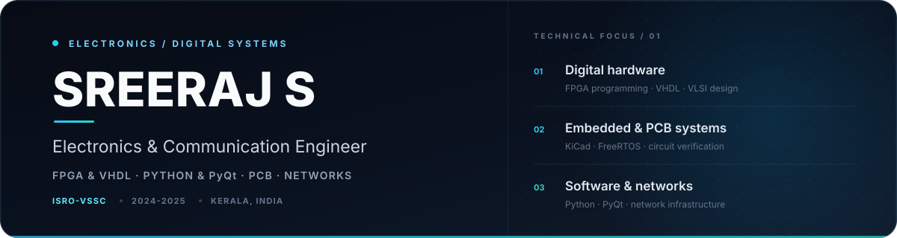

  

  &nbsp;
  &nbsp;
  

---

## 🧑‍💻 About Me

I am an Electronics and Communication Engineering graduate working across **digital hardware, electronics verification, developer tooling, and network systems**. My experience includes a one-year graduate apprenticeship at **ISRO – Vikram Sarabhai Space Centre**, where I programmed FPGA cards in VHDL, built Python/PyQt tools, supported package testing, and verified PCB circuits with KiCad.

> *My approach is practical: understand the system, test it carefully, document it clearly, and improve its reliability.*

  

## 💼 Experience

<table>
  <tr>
    <td width="60" align="center">🚀</td>
    <td>
      <strong>Graduate Trainee Engineer · ISRO – VSSC</strong> 
      <code>MAR 2024 – MAR 2025</code> · Thiruvananthapuram, Kerala
        
      <ul>
        <li>Programmed FPGA cards using <strong>VHDL</strong></li>
        <li>Developed internal GUI tools with <strong>Python and PyQt</strong></li>
        <li>Supported package testing and technical documentation</li>
        <li>Contributed to circuit research, testing, performance, and reliability work</li>
        <li>Verified PCB circuits using <strong>KiCad EDA</strong></li>
      </ul>
    </td>
  </tr>
  <tr>
    <td width="60" align="center">🌐</td>
    <td>
      <strong>Junior Network Engineer · Soften Technologies</strong> 
      <code>DEC 2019 – MAY 2020</code> · Ernakulam, Kerala
        
      <ul>
        <li>Worked on network troubleshooting, monitoring, and implementation</li>
        <li>Supported network-device configuration and operational reliability</li>
      </ul>
    </td>
  </tr>
  <tr>
    <td width="60" align="center">📡</td>
    <td>
      <strong>In-plant Trainee · Doordarshan &amp; All India Radio</strong> 
      <code>JUL 2018 – AUG 2018</code> · Thiruvananthapuram, Kerala
        
      <ul>
        <li>Observed live studio systems and transmitter equipment in operation</li>
        <li>Gained practical exposure to broadcast electronics infrastructure</li>
      </ul>
    </td>
  </tr>
</table>

  

## 🛠️ Engineering Toolkit

| Domain | Technologies |
| :--- | :--- |
| **Digital Hardware** | `VHDL` `FPGA programming` `VLSI design` `Libero SoC` |
| **Embedded Systems** | `C` `Arduino` `FreeRTOS` `hardware integration` |
| **PCB &amp; Simulation** | `KiCad EDA` `Proteus` `OrCAD Capture` `EasyEDA` `circuit testing` |
| **Software Tooling** | `Python` `PyQt` `Git` `GitHub` `MATLAB` |
| **Networking** | `troubleshooting` `monitoring` `implementation` `device configuration` |

  &nbsp;
  &nbsp;
  &nbsp;
  &nbsp;
  &nbsp;
  &nbsp;
  &nbsp;
  &nbsp;
  

  &nbsp;
  &nbsp;
  &nbsp;
  &nbsp;
  &nbsp;
  &nbsp;
  

  

## 📂 Featured Projects

<table>
  <tr>
    <td width="50%" valign="top">
      <h3><a href="https://github.com/SREERAJSANTHOSH/EMG_Controlled_Robotic_Arm">🦾 EMG-Controlled Robotic Arm</a></h3>
      
<b>B.Tech Capstone Project</b>

      
An assistive robotics project exploring EMG-based control for an artificial arm designed for amputees. Bridges biomedical signal processing with embedded control systems.

      

        
        
        
        
      

    </td>
    <td width="50%" valign="top">
      <h3><a href="https://github.com/SREERAJSANTHOSH/SmartDustbin_With_IOT_Notification">🗑️ Smart Dustbin with IoT</a></h3>
      
<b>IoT Project</b>

      
An IoT-enabled smart dustbin system with automated notifications. Demonstrates hardware–software integration and real-world sensor-based automation.

      

        
        
        
        
      

    </td>
  </tr>
  <tr>
    <td width="50%" valign="top">
      <h3>🔧 Electronics Maintenance &amp; Repair</h3>
      
<b>Diploma Final Project</b>

      
A practical project centered on diagnosing, maintaining, and repairing electronic equipment with systematic troubleshooting methodologies.

      

        
        
        
      

    </td>
    <td width="50%" valign="top">
      <h3>💡 More Coming Soon</h3>
      
<b>Active Development</b>

      
Working on new projects in FPGA development, embedded systems, and engineering automation tools. Stay tuned!

      

        
        
        
      

    </td>
  </tr>
</table>

## 🎓 Education

<table>
  <tr>
    <td width="60" align="center">🏛️</td>
    <td>
      <strong>Bachelor of Technology · Electronics and Communication Engineering</strong> 
      College of Engineering, Adoor · First Class · <code>2020 – 2023</code>
    </td>
  </tr>
  <tr>
    <td width="60" align="center">📘</td>
    <td>
      <strong>Diploma · Electronics and Communication Engineering</strong> 
      NSS Polytechnic College, Pandalam · First Class with Distinction · <code>2016 – 2019</code>
    </td>
  </tr>
</table>

## 📜 Training &amp; Credentials

- 🏅 NATS apprenticeship certificate · Board of Apprenticeship Training (BOAT)
- 🌐 Training programs in **CCNA** and **MCSE**
- 📚 NPTEL · Developing Soft Skills and Personality
- 🗣️ Languages: **English** and **Malayalam**

  

## 📊 GitHub Analytics

  <picture>
    <source media="(prefers-color-scheme: dark)" srcset="https://github-readme-stats-sigma-five.vercel.app/api?username=sreerajsanthosh&show_icons=true&theme=transparent&hide_border=true&title_color=38bdf8&text_color=94a3b8&icon_color=2dd4bf&ring_color=22d3ee&bg_color=00000000&rank_icon=github"/>
    
  </picture>
  <picture>
    <source media="(prefers-color-scheme: dark)" srcset="https://github-readme-stats-sigma-five.vercel.app/api/top-langs/?username=sreerajsanthosh&layout=compact&theme=transparent&hide_border=true&title_color=38bdf8&text_color=94a3b8&bg_color=00000000"/>
    
  </picture>

 

  <picture>
    <source media="(prefers-color-scheme: dark)" srcset="https://streak-stats.demolab.com?user=sreerajsanthosh&theme=transparent&hide_border=true&ring=38bdf8&fire=22d3ee&currStreakLabel=2dd4bf&sideLabels=94a3b8&dates=64748b&currStreakNum=e2e8f0&sideNums=e2e8f0&background=00000000"/>
    
  </picture>

 

  <picture>
    <source media="(prefers-color-scheme: dark)" srcset="https://github-readme-activity-graph.vercel.app/graph?username=sreerajsanthosh&bg_color=00000000&color=7dd3fc&line=22d3ee&point=2dd4bf&area=true&hide_border=true&area_color=0ea5e933"/>
    
  </picture>

---

  

  Interested in <b>FPGA development</b>, <b>embedded systems</b>, <b>electronics verification</b>, <b>network infrastructure</b>, and <b>engineering tools</b>. 
  📫 Reach me at <a href="mailto:sree98mdy@gmail.com">sree98mdy@gmail.com</a> · <a href="https://www.linkedin.com/in/sreeraj-santhosh-64a285243/">LinkedIn</a>

